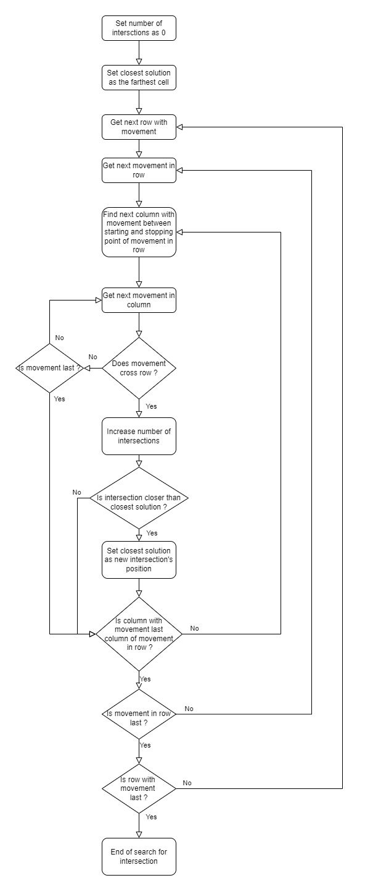

Software Design Description
===========================

## Scope

This document presents the choices of design and implementation to solve a "Mirrors and Laser" problem as described by
the [source](Reference/Mirrors.pdf) document and reminded by the [problem description](#Problem description).

## Problem description

We define a safe as an optical closure mechanism, with a rectangular grid and several mirrors in within.
The grid consists of R rows and  C columns, there are M mirrors with orientation /, and N mirrors with orientation \.
We define the range for each parameter: `1 <= R, C <= 1.000.000` and `0 <= M, N <= 200.000`.

When the laser is activated, a beam enters the top row of the grid horizontally from the left. 
The beam is reflected by every mirror that it hits. Each mirror has a 45 degree diagonal orientation, either / or \.
If the beam exits the bottom row of the grid horizontally to the right, it is detected and the safe opens.
Otherwise, the safe remains closed and an alarm is raised.

Each safe has a missing mirror, which prevents the laser beam from traveling successfully through the grid.
The safe has a mechanism that enables the user to drop a single mirror into any empty grid cell.
A legitimate user knows the correct position and orientation of the missing mirror and can thus open the safe.
Without this knowledge the user has to guess correctly, which can be difficult for safes with large grids. 

The problem is to determine if particular safes are actually secure. A secure safe does not open right away without
inserting a mirror, and there is at least one valid location and orientation for the missing mirror. 
There may indeed be multiple such locations and orientations.

The following image illustrate an example of an opened safe (left) and the same safe in a closed configuration 
which need another mirror to be opened (right).

  

## Solution

This section discusses the different parts needed to solve a well-defined problem.

### Specification

We define "finding solutions of any Mirrors and Laser problem" as determining all the exact positions where one and only
one added mirror can create a continuous path for the laser beam to reach the detector.

One can simply find all the solutions by finding all the intersections between the laser beam and a "reverse beam" 
coming from the detector itself.
This gives us the following steps needed to make the associated algorithm:

1. Compute the trajectory of the laser beam, called *forward trajectory*.
2. Check if the laser reaches the detector.
3. If the laser reaches the detector with only the initial context, no more solutions are computed even if some may exist.
4. If not, compute the reversed trajectory, starting from the detector, called *backward trajectory*.
5. Compute the intersections between the two trajectories. These intersections are the positions where a mirror is needed to solve the problem.

For instance, taking the same example as the [problem description](#Problem description), we can represent the 
alogrithm philosophy by the following image: 

  

### Computing trajectories

The first important step is the computation of a trajectory.

The starting points are easily determined given any initial context: the laser is always at the top left, specifically
at the position ``(1, 0)``, and the detector at the bottom right, specifically at position ``(maxRow, maxColumn + 1)``.
Remember that the safe is defined with row and column starting from one (1), that means we can consider the laser and 
the detector outside the safe itself. The initial directions are always the same: the laser beam goes to the right and
the reverse one goes to the left.

One could consider the safe as a matrice, with each element representing the presence of a mirror, then parse the matrice
element by element and change the direction when a mirror is met. However, this requires a lot of computation time as
every cell could be parsed, leading to a solution of ``O(R*C)`` complexity time, with ``R`` the number of rows and ``C``
the number of columns. Also, a lot of memory is needed as every cell are represented, including empty ones.

To avoid these problems, one should consider only the mirrors themselves as the empty cells do not possess any usefull 
information. This makes a graph but without any connectivity which are to be determined. One could determine all of this possible
connections between mirrors but this would lead to a comparison between all the mirrors with each other and create unused
connections. A better approach is to follow only the direction of the beam to create the usefull connection between mirrors,
thus avoiding unnecessary comparison.

Then, one could compute both the forward and backward trajectory at the same time by parsing all the mirrors
to find the next mirror, ie the closest mirror in the given direction from a given point, in the path of each trajectory.
However, while the possibility to compute both trajectory at the same time is attractive as it could divide the
complexity time by half, this method requires parsing **all** the mirrors each time, leading to a maximum complexity time of
``O((M+N)²)``, where `M` is the number of / mirror and `N` is the number of \ mirror.
Note that passed mirrors can not be ignored for the next iterations as they can be used both sides and both 
trajectories can pass through the same mirrors.

A better solution is to map each row and column, containing at least one mirror, to the set of their contained mirrors.
Thus, the whole list of mirrors is parsed only once and the search for the next mirror is limited only to the mirrors in
the same column or row depending on the direction of the beam. The resulted complexity time for each iteration is
``O(C)`` where `C` is the average number of mirror in the rows/columns. The whole complexity time to compute a trajectory
is then `O(S*C)` where `S` is the number of mirror in the trajectory and `C` is the average number of mirror in the rows/columns. 
Note that it is not possible to compute both trajectory at the same time now but the gained time is still better with the
latest approach.

However, it is best to pre-sort the maps of non-empty row/columns to avoid unnecessary comparison. 
That way, the next mirror in the path is simply the next or previous mirror in the list and the only thing to compute is
finding the mirror at the current position.
This creates a solution of complexity time for each iteration of ``O(C*log(C))`` where `C` is the average number of mirror
in the rows/columns. The pre-sort itself has the same complexity time for each non-emtpy row/column thanks to build-in
efficient sorting algorithms in programming languages. Note that this solution is better for very complex cases with
a very high average number of mirror in rows/columns and will be slightly slower for very simple problems because of the 
added pre-sort.

Yet, the most optimized solution avoids finding the mirror at the current position. Since the current position has
necessarily a mirror (or the laser/detector which can be represented by faked mirrors) otherwise the trajectory would have ended,
the current mirror can be directly accessible if the mirrors are pre-mapped and sorted to their position in their mapped
rows/columns. The resulted complexity time for the whole trajectory would be then ``O(S)`` where `S` is the number of 
mirror in the trajectory.

### Finding intersections

Once the trajectories are computed, we need to compute the position of the intersections between them in order to find the solutions
to the problem.

One can observe that we only need to compare the horizontal (row) movements of one trajectory to the vertical (column)
movements of the other trajectory, as it is the only possibility for an intersection to happen. A straightforward 
strategy would be to compare every movement horizontally to every movement vertically but would be of complexity time 
``O(H*V)`` where `H` is the total number of horizontal movement and `V` the total number of vertical movement.

A better approach would be to restrict the search as not every movement has the possibility to intersect another one.
A good strategy would compare each horizontal movement to only the vertical movements which are between the starting
and the stopping point of the horizontal movement. That way, the complexity time for each horizontal movement is linear
to the length of the movement and to the average number of movements in non-empty columns, up to `O(H*l*mv)` where
`H` is the total number of horizontal movement, `l` the average length of horizontal movement and `mv` the average 
number of vertical movements in non-empty columns.

In order to implement the last solution, it is required to create two (2) maps for each trajectory, linking non-empty
rows/columns to the list of movements they contain. This can be done at the same time as the computation of the trajectories
without drawbacks as it is only putting already used data in memory.

### Flowcharts

The finals algorithms are represented with the following flowcharts:

1. Flowchart for finding all solutions:

  

2. Flowchart for computing a trajectory:

  

3. Flowchart for computing intersections between a map of rows with movements and a map of columns with movements: 

  

## Implementation

### Architecture

For a better scalability of the implementation, taking into account possible evolutions, we defined several abstractions.

First, in order to model a problem, we defined a Mirror class to represent a mirror that let us reflect any incoming
beam of light from any defined direction (right, left, up or down). 
Each instances possess their position and their kind of mirror. 
We also defined a Safe class to represent a safe. It contains the number of rows and columns that describes the safe, and
a list of Mirror. For security, an error message is displayed if the number of rows or columns is superior to the defined
limit (one million) but do not throw an error, the behaviour is simply not assured to work properly. The list of mirrors
is also filtered at creation and when the number of rows or columns is changed to only keep mirrors that are inside the safe.

Then, we defined a SafeBreaker class which only contains the algorithms and data to solve any given Safe.
It is the implementation of the previously seen algorithms.

Finally, we defined an Api class to manage the input data, read from a file, and the output data, displayed and saved in
a seperate file. As such, the reading of the input file has been sanitized to avoid most of the common errors such as
having less mirrors than declared, empty lines, non-conforming lines (too much or not enough data in one line).
It also displays an error if the number of mirror of each kind is too high but does not throw an error, the behaviour is
just not assured to be nominal.
It is the entry point for any user wanting to solve one or more problem.

The architecture is summarized by the following class diagram:

### Use case

The following image describes the sequence diagram of the solution implementation for solving a set of problem.

### Tests

Some tests input can be found in the **Tests** directory. These where made to verify the implementation of the solution
and its computing time for extrem cases.

The [StandardTests](../Tests/StandardTests.txt) is a set of small tests, including the example of the problem description,
a case with a million rows and columns with one mirror (one straightforward solution), a case which solution is on the 
edge of the safe, a case with no mirror (impossible), a case which use a mirror twice (no solution needed), a case with
a laser beam creating a square-like shape (two solutions) and a case which solutions are at the closest cell of the laser
and the detector (two solutions).

The [StressTest1](../Tests/StressTest1.txt) represents an impossible problem with a maximum number of rows,
a maximum of column and a maximum of mirror of each kind placed randomly. Resulted computing time: 428ms.

The [StressTest2](../Tests/StressTest2.txt) represents an impossible problem with only a maximum of mirror of each
kind placed randomly in a grid small enough so most of the cells have a mirror. Resulted computing time: 430ms.

The [StressTest3](../Tests/StressTest3.txt) represents a problem with only a maximum of mirror of each
kind placed to maximize the trajectory length of the laser beam (trajectory looks like to a V).
The laser reaches the detector by default. Resulted computing time: 397ms.

The [StressTest4](../Tests/StressTest4.txt) is the same as the StressTest3 but with a missing mirror in the middle
of the trajectory. This creates a complex case where both trajectories are very long, thus making comparison to find
intersections complex. Resulted computing time: 467ms.

The [StressTest5](../Tests/StressTest5.txt) is the worst case scenario type of problem with a maximum of mirror of each
kind placed only on two different rows (first and last), making the search of the next mirror in trajectory longer. 
The laser beam reaches the detector. Resulted computing time: 385ms.

The [StressTest6](../Tests/StressTest6.txt) is the same as the StressTest5 with a missing mirror in the middle of the
trajectory.
This makes the comparison for finding solutions more difficult and longer. Resulted computing time: 580ms.