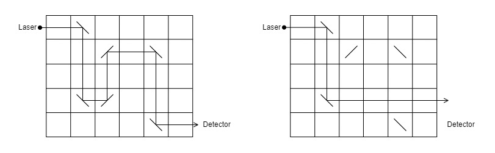

How to use
==========

## Scope

This document is aimed for users wanting to solve a specific set of "Mirrors and Laser problem" as described by the
[source document](Documentation/Reference/Mirrors.pdf) and the [overview](#Overview).

This document describes the steps to follow in order to [compile and install](#Compilation) the program,
[customize](#Customizing the Mirrors and Laser problem) a set of problems and [launch](#Launch and results) the program.

For technical information about the solution, its architecture and its implementation, please refer to the 
[design document](Documentation/SoftwareDesignDescription.md).

## Overview

We define a safe as an optical closure mechanism, with a rectangular grid and several mirrors in within.
The grid consists of R rows and  C columns, there are M mirrors with orientation /, and N mirrors with orientation \.
We define the range for each parameter: `1 <= R, C <= 1.000.000` and `0 <= M, N <= 200.000`.

When the laser is activated, a beam enters the top row of the grid horizontally from the left.
The beam is reflected by every mirror that it hits. Each mirror has a 45 degree diagonal orientation, either / or \.
If the beam exits the bottom row of the grid horizontally to the right, it is detected and the safe opens.
Otherwise, the safe remains closed and an alarm is raised.

Each safe has a missing mirror, which prevents the laser beam from traveling successfully through the grid.
The safe has a mechanism that enables the user to drop a single mirror into any empty grid cell.
A legitimate user knows the correct position and orientation of the missing mirror and can thus open the safe.
Without this knowledge the user has to guess correctly, which can be difficult for safes with large grids.

The problem is to determine if particular safes are actually secure. A secure safe does not open right away without
inserting a mirror, and there is at least one valid location and orientation for the missing mirror.
There may indeed be multiple such locations and orientations.

The following image illustrate an example of an opened safe (left) and the same safe in a closed configuration
which need another mirror to be opened (right).

<p align="center">
  
</p>

The current program is aimed to solve any Mirrors and Laser problem. This document presents you how to use it.

## Compilation

To compile the source files, you need the following applications:

1. Any C++ compiler using C++20.
2. (Optionnal) Cmake 3.21 or later.

The source code uses only the standard library and no other third-party libraries are needed.

Using Cmake, you can either use its graphical user interface (all the source files are in the **src** directory) or use
the **CMakeLists.txt** to build the project.

Without CMake, you can use any compiler compatible with C++20, like g++, to build the project.
For instance, using g++, the command line would be:

```
g++ -std=c++20 src/* -o build/SafeAndMirrorsProblem
```

Whichether method you use, please ensure to build the executable file in the **build** directory.

## Customizing the Mirrors and Laser problem

The execution of the program requires an **input.txt** file in the same directory as the executable file.
One can be found in the **build** directory and contains simple cases used for testing.

This **input.txt** file shalls countain the data describing at least one Mirror And Laser problem and be written as
follows:

1. The first line should describe the general context: number of rows, number of columns, number of / mirrors and number of \ mirrors.
2. The next lines should precise the position of each mirror (row then column). First the / mirrors then the \ mirrors.

**Notes**: No empty lines are needed between different cases and numbers should be seperated only using a single space.
The number of rows and columns must be comprised between one (1) and one million (1 000 000), and the number of mirrors 
between zero (0) and two hundred thousand (200 000) for each kind.

Example of input:

```
5 6 1 4
2 3
1 2
2 5
4 2
5 5
100 100 0 2
1 1
100 1
100 100 0 0
```

## Launch and results

When the **input.txt** file is customized, you can execute the program which will display, case by case, the number
of solutions and the lexicographically closest solution (row then column) then save them in a **output.log** file 
in the same directory. If there is no solution to the problem, the program will display "impossible" instead.

Example of output:

```
Case 0: 2 4 3
Case 1: 0
Case 2: impossible
```